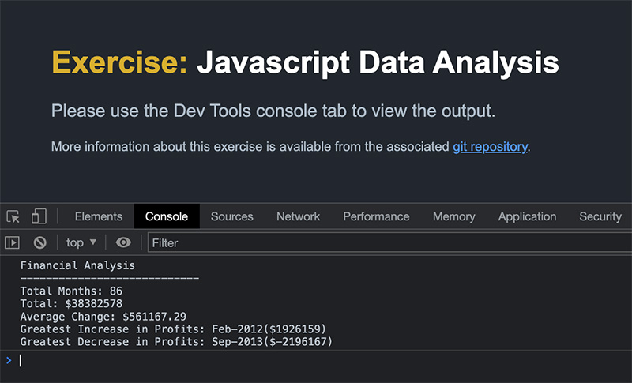

# Console-Finances
Exercise - analysing a set of financial records using JavaScript


Set as part of [the Trilogy Skills Bootcamp in Front-End Web Development](https://skillsforlife.edx.org/coding/frontend/landing/?s=Google-Unbranded&pkw=web%20design%20training&pcrid=624628533241&pmt=p&utm_source=google&utm_medium=cpc&utm_campaign=GGL%7CSKILLS-FOR-LIFE%7CSEM%7CCODING%7C-%7COFL%7CTIER-1%7CALL%7CNBD-G%7CBMM%7CPrimary%7CSubject-Matter&utm_term=web%20design%20training&s=google&k=web%20design%20training&utm_adgroupid=140443158663&utm_locationphysicalms=1006886&utm_matchtype=p&utm_network=g&utm_device=c&utm_content=624628533241&utm_placement=&gclid=Cj0KCQjwqc6aBhC4ARIsAN06NmMdwBRSe3BLeaChkukN5Bbqb18220k1ku9TB2o9tzsX0xYUc-dlRWgaAuyvEALw_wcB&gclsrc=aw.ds).

Students were provided with an index.html file and an index.js which was set up with a finances array containing the data to be processed. The task was to write JavaScript code that analyzes the records, calculating each of the following:

* The total number of months included in the dataset.

* The net total amount of Profit/Losses over the entire period.

* The average of the **changes** in Profit/Losses over the entire period.
  * You will need to track what the total change in profits are from month to month and then find the average.
  * (`Total/Number of months`)

* The greatest increase in profits (date and amount) over the entire period.

* The greatest decrease in losses (date and amount) over the entire period.

The ultimate goal was to log the analysis to the console, formatted to match the following example output:

  ```text
  Financial Analysis
  ----------------------------
  Total Months: 25
  Total: $2561231
  Average  Change: $-2315.12
  Greatest Increase in Profits: Feb-2012 ($1926159)
  Greatest Decrease in Profits: Sep-2013 ($-2196167)
  ```

The project has been [deployed on GitHub Pages](https://paulashby.github.io/Console-Finances).

## Installation

If for any reason you would like to deploy the project yourself, simply fork this repository, then go to the Settings page of your fork on GitHub, select <kbd>Pages</kbd> and set the <kbd>Branch</kbd> dropdown to <kbd>main</kbd>.

## Usage

If you wish to use this project to analyse your own financial data (with the caveat that the output always be checked by a professional accountant), you can update the finances array in your forked version (see [Installation](#installation)) with your own figures, taking care to respect the integrity of the existing data structure. Alternatively, you can visit [my deployed site](https://paulashby.github.io/Console-Finances) to see the output of the script when processing the default data.

## Credits
Thanks to [the Trilogy Skills Bootcamp in Front-End Web Development](https://skillsforlife.edx.org/coding/frontend/landing/?s=Google-Unbranded&pkw=web%20design%20training&pcrid=624628533241&pmt=p&utm_source=google&utm_medium=cpc&utm_campaign=GGL%7CSKILLS-FOR-LIFE%7CSEM%7CCODING%7C-%7COFL%7CTIER-1%7CALL%7CNBD-G%7CBMM%7CPrimary%7CSubject-Matter&utm_term=web%20design%20training&s=google&k=web%20design%20training&utm_adgroupid=140443158663&utm_locationphysicalms=1006886&utm_matchtype=p&utm_network=g&utm_device=c&utm_content=624628533241&utm_placement=&gclid=Cj0KCQjwqc6aBhC4ARIsAN06NmMdwBRSe3BLeaChkukN5Bbqb18220k1ku9TB2o9tzsX0xYUc-dlRWgaAuyvEALw_wcB&gclsrc=aw.ds) for dreaming up the exercise. Thanks also to Philip Howley, the course Instructor and Brooke Love, my personal teaching assistant.

## License
Licensed under the [MIT](https://github.com/paulashby/Console-Finances/blob/main/LICENSE) license.


